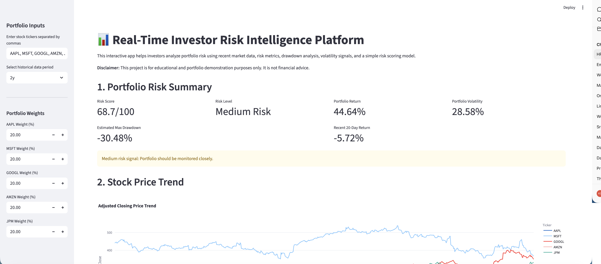
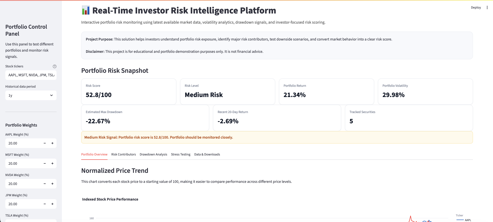
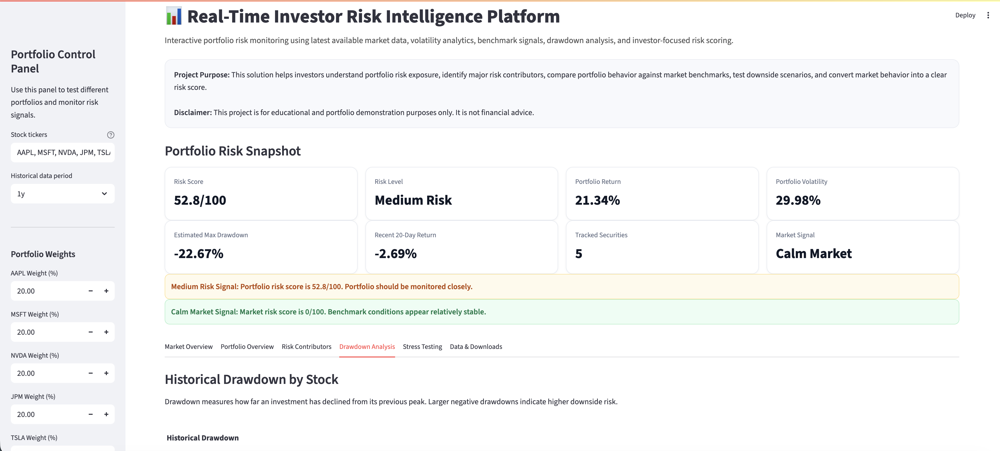
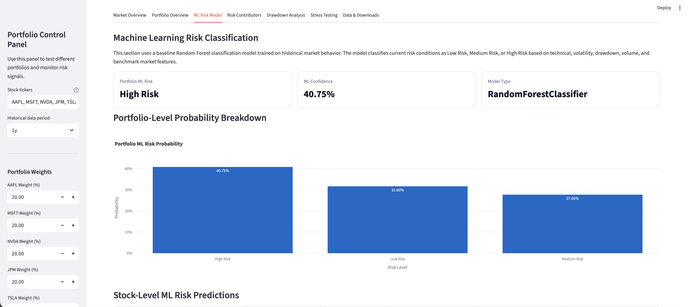

# Real-Time Investor Risk Intelligence Platform

## Project Overview

The **Real-Time Investor Risk Intelligence Platform** is an interactive financial analytics application that helps investors monitor portfolio risk using latest available market data, benchmark indicators, stress testing, and a baseline machine learning risk classification model.

This project is designed as a solution-based portfolio project, not just a static dashboard. Users can enter stock tickers, assign portfolio weights, compare their portfolio against market benchmarks, review volatility and drawdown risk, run downside stress tests, and view machine learning-based risk predictions.

## Business Problem

Investors often track stock prices, returns, market news, and risk indicators separately. This makes it difficult to understand overall portfolio risk in one place.

This project solves that problem by combining:

* Portfolio risk analytics
* Market benchmark comparison
* VIX-style market risk signal
* Drawdown analysis
* Stress testing
* Machine learning risk classification

The goal is to help users answer:

* Is my portfolio currently low risk, medium risk, or high risk?
* Which holdings are contributing the most risk?
* How does my portfolio compare with SPY and QQQ?
* Are current market conditions calm, cautious, or high risk?
* What could happen under a market shock scenario?
* What does the machine learning model classify as the current risk level?

## Live App

Deployment link will be added after the Streamlit app is published.

```text
Live App: Coming Soon
```

## Tools and Technologies

* Python
* Streamlit
* Pandas
* NumPy
* yfinance
* Plotly
* Scikit-learn
* Joblib
* GitHub
* VS Code

## Key Features

* Latest available market data retrieval
* Custom portfolio ticker input
* Portfolio weight adjustment
* Portfolio risk score
* Rule-based risk classification
* SPY and QQQ benchmark comparison
* VIX-style market risk signal
* Portfolio vs benchmark performance chart
* Risk contribution analysis
* Historical drawdown analysis
* Stress testing slider
* Downloadable portfolio metrics
* Baseline machine learning risk model
* Stock-level ML risk predictions
* Portfolio-level ML risk prediction
* Model confidence and feature importance

## Application Tabs

The Streamlit app includes the following sections:

1. **Market Overview**
   Shows SPY, QQQ, VIX-style market signal, benchmark metrics, and portfolio vs benchmark comparison.

2. **Portfolio Overview**
   Shows indexed performance, holdings summary, returns, volatility, drawdown, and trend status.

3. **ML Risk Model**
   Displays portfolio ML risk level, model confidence, stock-level predictions, probability breakdown, and feature importance.

4. **Risk Contributors**
   Identifies which holdings contribute the most weighted volatility risk.

5. **Drawdown Analysis**
   Shows historical drawdown by stock and benchmark drawdown context.

6. **Stress Testing**
   Allows users to simulate downside market shock scenarios.

7. **Data & Downloads**
   Displays raw market data previews and downloadable risk metrics.

## Screenshots

### Version 1.0 - Initial Working App



### Version 1.1 - Professional UI



### Version 1.2 - Market Benchmarks



### Version 2.1 - ML Risk Model



## Project Architecture

```text
User Inputs
   |
   |-- Stock Tickers
   |-- Portfolio Weights
   |-- Historical Period
   |
   v
Streamlit Application
   |
   v
Market Data Retrieval
   |
   |-- Portfolio Tickers
   |-- SPY
   |-- QQQ
   |-- VIX
   |
   v
Risk Analytics Layer
   |
   |-- Returns
   |-- Volatility
   |-- Drawdown
   |-- Risk Score
   |-- Stress Testing
   |
   v
Machine Learning Layer
   |
   |-- Feature Engineering
   |-- Random Forest Classifier
   |-- Risk Prediction
   |-- Model Confidence
   |
   v
Interactive Investor Risk Dashboard
```

## Machine Learning Model

The project includes a baseline **Random Forest Classifier** that predicts:

* Low Risk
* Medium Risk
* High Risk

The model uses engineered financial features such as:

* Daily return
* 5-day return
* 20-day return
* 20-day volatility
* 60-day volatility
* 60-day maximum drawdown
* Moving average gap
* Volume change
* SPY return and volatility
* QQQ return
* VIX level and VIX change

The target label is based on future 5-day return behavior:

| Future 5-Day Return                            | Risk Label  |
| ---------------------------------------------- | ----------- |
| Less than or equal to -3%                      | High Risk   |
| Greater than -3% and less than or equal to +1% | Medium Risk |
| Greater than +1%                               | Low Risk    |

The baseline model achieved approximately **48.43% accuracy**. This is documented as a first-version educational model, not a production-grade financial prediction model.

## Repository Structure

```text
real-time-investor-risk-intelligence/
│
├── app/
│   └── streamlit_app.py
│
├── assets/
│   └── screenshots/
│
├── data/
│   ├── raw/
│   └── processed/
│
├── docs/
│   ├── project_summary.md
│   ├── business_problem.md
│   ├── solution_architecture.md
│   ├── data_sources.md
│   ├── risk_methodology.md
│   ├── model_documentation.md
│   ├── app_features.md
│   └── limitations_future_work.md
│
├── model/
│   ├── train_risk_model.py
│   ├── risk_model.pkl
│   ├── model_features.json
│   └── model_performance.csv
│
├── notebooks/
│
├── requirements.txt
├── .gitignore
└── README.md
```

## How to Run Locally

Clone the repository:

```bash
git clone https://github.com/udaybhaskar-23/real-time-investor-risk-intelligence.git
```

Navigate into the project folder:

```bash
cd real-time-investor-risk-intelligence
```

Create a virtual environment:

```bash
python3 -m venv .venv
```

Activate the virtual environment:

```bash
source .venv/bin/activate
```

Install dependencies:

```bash
pip install -r requirements.txt
```

Run the Streamlit app:

```bash
streamlit run app/streamlit_app.py
```

## How to Train the Model

Run the model training script:

```bash
python model/train_risk_model.py
```

This generates:

```text
model/risk_model.pkl
model/model_features.json
model/model_performance.csv
```

## Documentation

Detailed documentation is available in the `docs/` folder:

* [Project Summary](docs/project_summary.md)
* [Business Problem](docs/business_problem.md)
* [Solution Architecture](docs/solution_architecture.md)
* [Data Sources](docs/data_sources.md)
* [Risk Methodology](docs/risk_methodology.md)
* [Model Documentation](docs/model_documentation.md)
* [App Features](docs/app_features.md)
* [Limitations and Future Work](docs/limitations_future_work.md)

## Current Version

The current project includes:

* Version 1.0: Initial working Streamlit app
* Version 1.1: Professional UI upgrade
* Version 1.2: Market benchmark indicators
* Version 2.0: Baseline machine learning risk model
* Version 2.1: ML model connected to Streamlit app

## Future Enhancements

Planned improvements include:

* Streamlit Cloud deployment
* FRED macroeconomic indicators
* Sector concentration analysis
* Correlation heatmap
* Covariance-based portfolio volatility
* Sharpe and Sortino ratios
* Value at Risk and Conditional Value at Risk
* SHAP model explainability
* Automated model retraining
* Portfolio optimization
* Downloadable PDF risk report

## Disclaimer

This project is for educational and portfolio demonstration purposes only. It is not financial advice, investment advice, or a trading recommendation. The risk scores, model predictions, and stress-test outputs are simplified analytical indicators and should not be used as the sole basis for investment decisions.
